# Behavioral Cloning By *Mohamed Eltohamy*
----

This project aims to  train a car in the Udacity simulator to navigate the its tracks safely and smoothly as possible basically to make a car drive autonomously, to achieve this I'll be using the following techniques :

* Drive through the simulator to collect driving data 
* Build a model architecture with convolutions in [Keras](https://keras.io/) that predicts steering angels for images
* Train the model and validate it with the collected driving data and maybe add some augmentation
* Let the model drive the car autonomously and test if the car drives safely through the tracks
* Finally record a video of the final model and the successful run

# Youtube Videos of the Model in action:
----
Here are some video links to the stages of training and the final runs of the project enjoy :) 

## Behavioral Cloning Training Journey

## Behavioral Cloning Autonomous Mode on 2 Tracks

## Project Structure
----

This project is divided into multiple files and directories:

### Files
1. [`model.py`](/mode.py) main file where I load the data, create a `KerasModel`, train the model, and plot loss
2. [`keras_model.py`](/keras_mode.py) has all Keras implementation under a custom class `KerasModel` that I used in the project
3. [`utils.py`](/utils.py) this file has some utility drawing and other methods
4. [`drive.py`](/drive.py) this file takes in the trained model, connects to the simulator, and drive the car autonomously 
5. [`model.h5`](/model.h5) is the final trained model 

### Directories
1. [`assets`](/assets) include writeup images and some selected test images for each track
2. [`models`](/models) this directory includes some (a lot) trained variations of the model 
3. [`DrivingData`](/DrivingData) here are the driving data for the first track (Lake)
4. [`DrivingData_track2`](/DrivingData_track2) here are the driving data for the second hilly (jungle) track
5. [`Graph`](/graph/) a directory that includes `Tensorboard` of the final model
6. [`Videos`](/videos/) the directory that houses the final videos

# Libraries and Frameworks
----
To complete this project I've used a varaity of libraries and frameworks like `numpy`, `matplotlib`, `OpenCV`, `sklearn`, etc., but chief among them is `Keras` and `Tensorflow`.

</img>

**Keras** is just a Godsent high level wrapper that uses **Tensorflow** or **Theano** as back-ends, its an **OOP** dream come true after dealing with **Tensorflow's** lets say bad modularity. It has really cool features that are used in this project as we'll see in the coming sections. **Tensorflow** acts as the back-end that **Keras** operates on top of, **Keras** constructs **Tensorflow** model graph, trains, evaluates, and infer our models, all without us have to write any `tf` code. We get all the power of both frameworks which take advantage of the machine **GPU** that perform parallel operations to speed up training and inference especially for image data.

# Data Collection and Exploration
----

### Data Collection

I used a **PS4 controller** to drive through the simulator which provided accurate data measurements for its use of the analog stick and not absolute numbers as using the keyboard, it gave me really good control than the mouse which I tried first didn't. I drove for `5` laps through the first **Lake track** mainly sticking to the center of the road, however, I speed up and reached the simulator top speed `30mph` for some laps to replicate sharp turns and recovery for the vehicle. The `5` laps yielded `18,675` images for the *center, left, and right* cameras thats `6,225` images each; this turned out to be a bane in the early stages of training for the car kept running circles, but in the long run this amount of data turned out to be just right. Here are some examples of first track *left, center, and right* images for the the same time-stamp:

|  Left Image  | Center Image  |  Right Image  |
|:-:|:-:|:-:|
|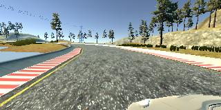|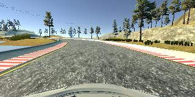|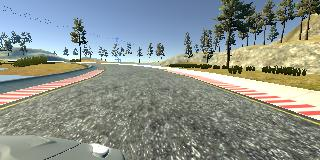|

I did the same thing for the second **Jungle track** which gave `37,809` images thats more that twice the first track's data, thats due to the second track being much longer and more complicated to navigate through its slopes and sharp turns. Here an example of the second track's *left, center, and right* images for the same time-stamp: 

|  Left Image  | Center Image  |  Right Image  |
|:-:|:-:|:-:|
|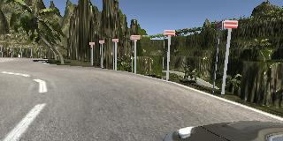||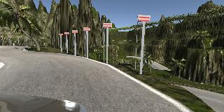|

## Data Exploration

#### Track One (Lake Track)
Here we'll study and explore our data to get a better idea of its qualities. So we got `6,225` center camera images and `18,675` from the left, center, and right combined. Here is a graph that shows our data frequency:

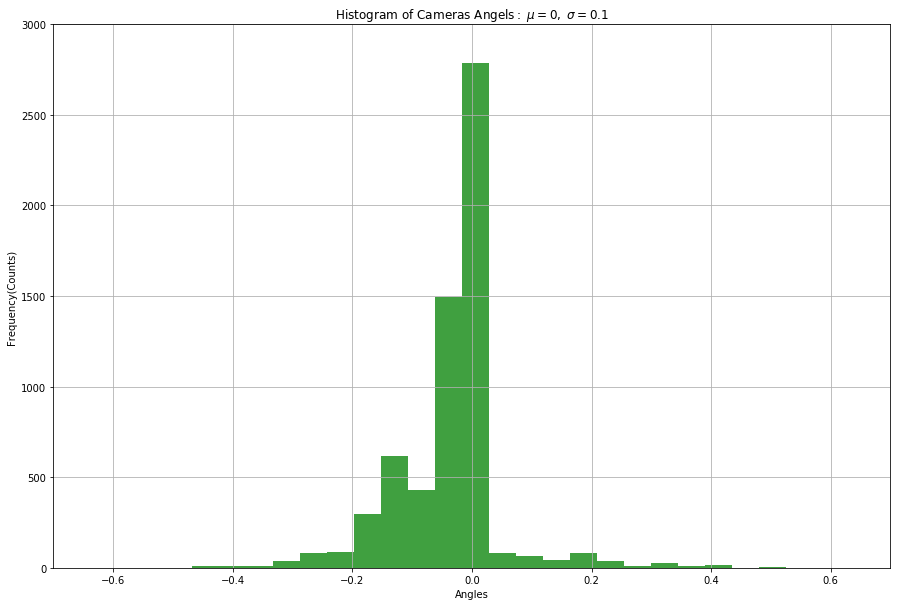

We can clearly see that most of the data has the steering angle close to `0` thats because of the track's straight nature and due to the fact that I was center driving while collecting the data. We can also notice that the data tend to *skew to the left* that because most of the turns in the track are left turns so our data is a little bit biased towards the left.

Now lets take all `3` camera images into account to provide us with more data and also help us make our model recover from veering to the side of the road. 

Now our data is more evenly distributed with most angles grouping around the center with a range of about `90` degree, however, there still a bias towards the left angels as shown in the graph for this I'll create a flipped version of the image to generalize the angel direction and eliminate this left bias.

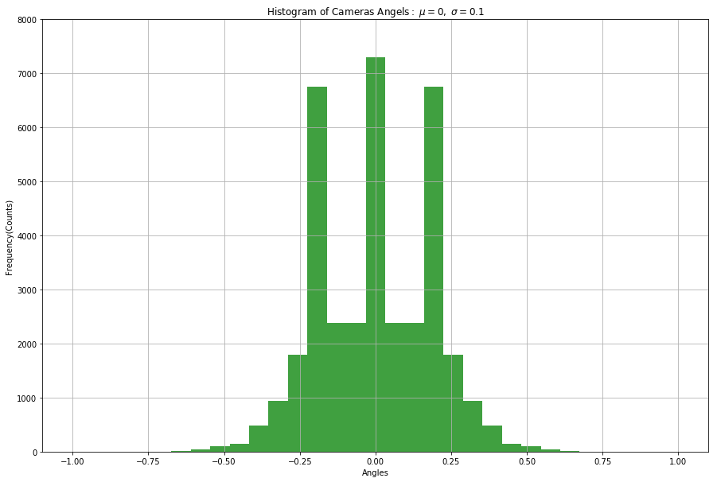

Now we have a neat distribution with the major angels closely grouped around `0` degrees.  

#### Track Two (Jungle Track)

Track 2 driving data gave `12,603` center images and `37,809` *left, right, and center* images, here is the frequency distribution of the center images: 

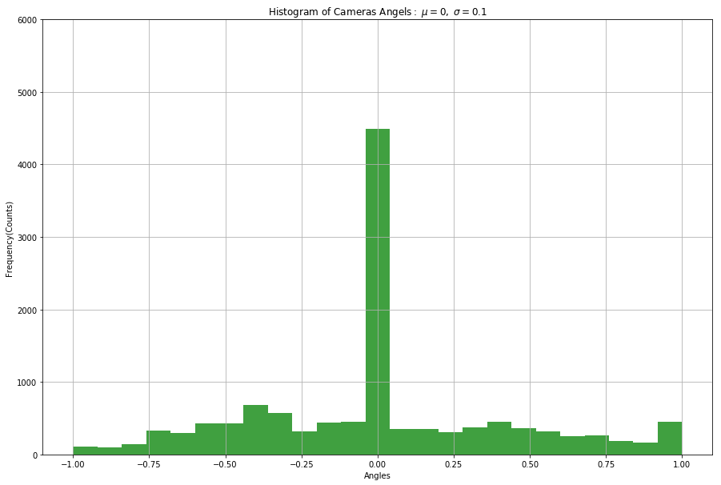

Here the data is fairly centered and distributed all over the place for the track is long, and full of sharp, wide, and normal turns and lots of them as we can see in the graph. I did the same thing and to all `3` camera images as we see below:

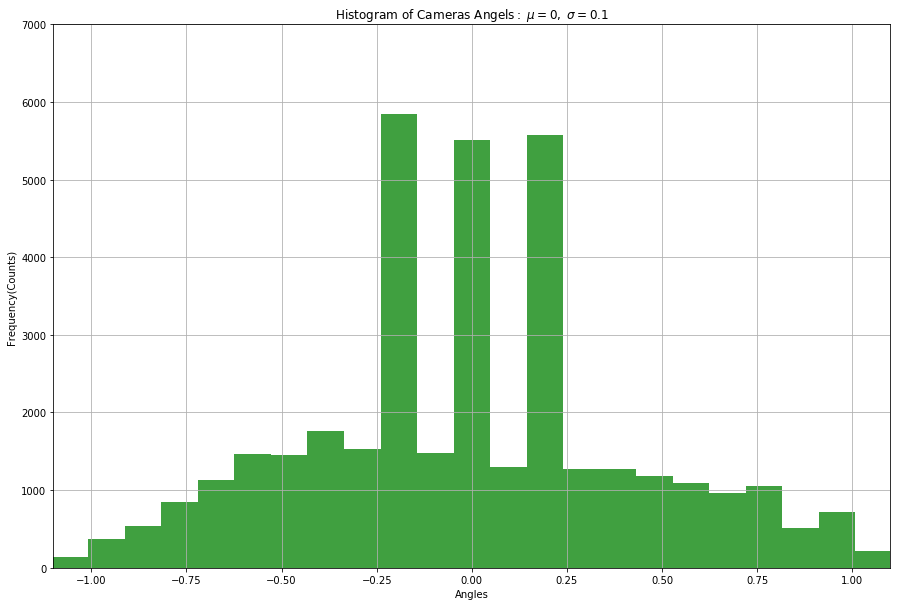

The data seem uniform an well distributed with the major angels centered around `0` degrees and the left and right correction of that which makes for a great data distribution, but we can see a slight number advantage for `-ve` angles which means that our data as track 1 has a slight bias towards left turns. Let's flip our data as we did for the first track and see if that mitigates our left turn bias.

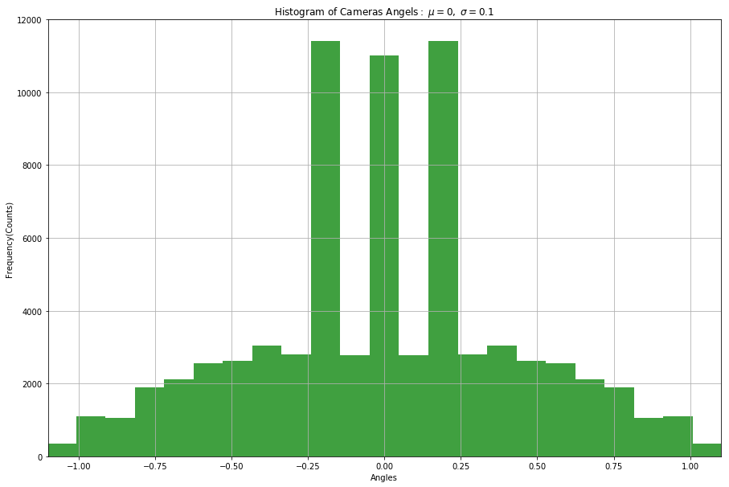

Now our data is uniformally distributed and ready to go.

# Model Architecture 
----

The model went through a number of changes before the last architecture was chosen.
1. Simple one layer regression
2. LeNet architecture
3. Nvidia's End to End Learning for Self-Driving Cars architecture
4. Enhanced Nvidia architecture
5. The Final model

## Simple Regression
----
I first constructed a single fully connected layer and trained it on the center images which made the car go into an infinite loop that was only broken by drowning in the lake or hitting a rock.

Then I followed the lessons and got the images from the other left and right cameras which was a little bit better, but my car preferred to venture to the left loop a little before it finally commits suicide. This was mainly because I collected a good number of data so the left bias was more apparent from the start.

After flipping the all my images the car stayed on the road though its driving wasn't a thing to brag about it was hesitant and wonky, let's say I wouldn't want to be a passenger and I trained the car.

## LeNet
----
Dealing with images is best suited for the magical `CovNets` so I used the simplest image classification architecture the **LeNet** architecture, it achieved really good results for the first track with *training loss* of `0.097%` and *validation loss* of `0.106%` which gave decent driving behavior in autonomous driving mode. The Network also performed well on the second more convoluted track (pun intended) and started to drive within some of the lanes, unfortunately it failed to finish the track with proper safe driving behavior.

## NVIDIA End to End Learning 
----
Then I applied the Nvidia architecture which from the [End to End Learning for Self-Driving Cars](http://images.nvidia.com/content/tegra/automotive/images/2016/solutions/pdf/end-to-end-dl-using-px.pdf) paper which crushed both tracks and got the lowest loss yet.

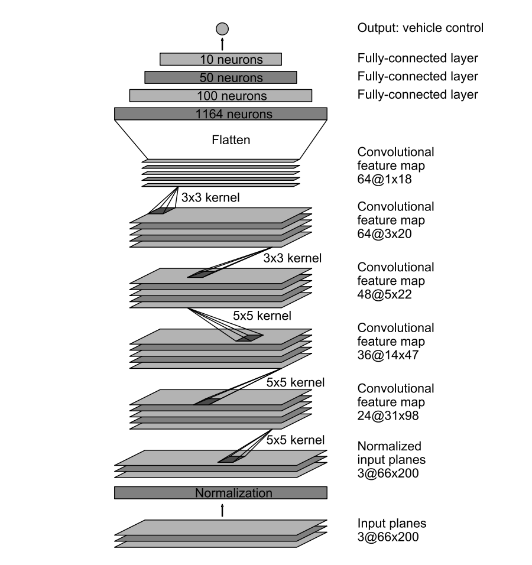

It performed very well that the loss of the first track fell to a record loss very close to `0`, however with a deeper network and a simple track like track one the validation loss climbed a bit higher and kept climbing. The noticeable improvement showed in track 2 after applying the architecture track 2 achieved the lowest training loss of `0.319%`over 20 epochs, but we suffered the same bane as track 1 the validation loss which was at its highest of `0.573%` and it also kept climbing as the case of track 1; so the model is clearly overfitting the training data thats why in the next section techniques will be employed to remedy this issue.

## Modified NVIDIA and (Final Architecture)
----
So a pretty famous technique to prevent the model from overfitting is **dropout**, it randomly sets a specified fraction of weights to `0` for the model to learn without depending on certain weights. I first added dropout to the whole network then tried it only on the convolutions which gave the better results. 

Upon training the validation loss kept fluctuated in later epochs, so a good technique to employ came to mind which was **batch normalization**. Batch Normalization is a technique that normalize the outputs of a layer which are the inputs for the next in our model, basically it does something close to the normalization we did to the images before feeding them to our model. This process increases training time due to its added computations, but it stabilizes layer inputs that in turn gives a more stable predictions and a faster convergence. Apart from the gained convergence speed it allows the model to use higher learning rates without sacrificing accuracy and it also has some regularization qualities.

Here is the model after modifying the Nvidia's architecture by adding both *dropout* and *batch normalization* :

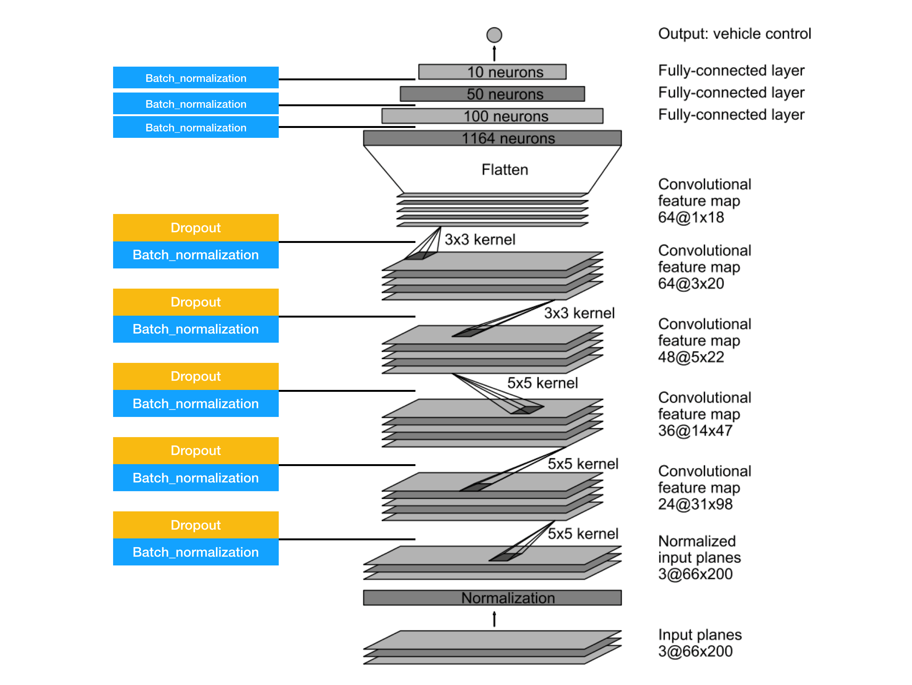

and here is a comparison of the model before and after using Batch Normalization:

|Without Batch Normalization|With Batch Normalization|
|:--:|:--:|
|||

As you can see the right graph (with batch normalization) is a lot more stable and doesn't fluctuate as the right counterpart (only dropout); however, we can clearly see that our model is converging slower not faster. This really didn't make and sense dropout is a great regularization technique and batch normalization should actually bring down the convergence speed, this paradox put me on the course of discovering why. 

## The Final Model
----
After I got the final architecture I kept Legoing the model changing things up, swapping batch normalization layers with the dropout trying to figure out what went wrong and how to remedy it, and after some search and personal experience I found that adding batch normalization and dropout together gives poor results. Through navigating the interwebs searching for answer I found out [this gem](https://arxiv.org/pdf/1801.05134.pdf), an amazing paper which was published earlier this year that explains the *disharmony* between batch normalization and dropout. 

They start the paper by mentioning that dropout and batch normalization should ascend and improve model performance which I totally agree to its like a match made in haven, then they go on and say that Dropout will shift the variance of a certain *neural unit* and it differs from training to inference, on the other hand Batch Normalization will maintain the *statistical variance* for inference, then they go on and say ***" The inconsistency of that variance (we name this scheme as “variance shift”) causes the unstable numerical behavior in inference that leads to more erroneous predictions finally, when applying Dropout before BN."*** and later on they prove this **variance shift** that I sure experienced in this project and others too which made me stop using batch normalization.

In the paper they introduced 2 different approaches for having both techniques work better together, I used the first approach of applying dropout after all batch normalization layers and since batch normalization has some regularization qualities our model will still generalize well. 

In applying this I got 2 different  architectures lets call them `BatchDrop0.1` and `BatchDrop0.2`:

The first (BatchDrop0.1) I got by mistake while implementing the batch normalization dropout combo:

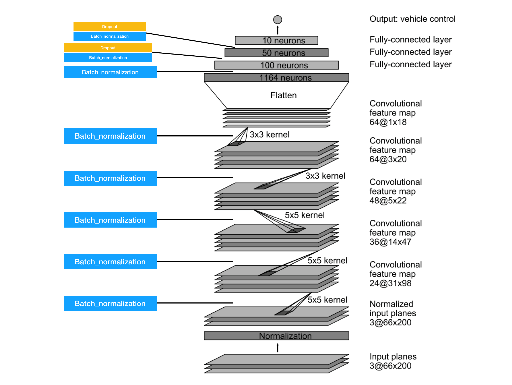

This architecture gave me really good results, but it wasn't that stable which made me lose hope, until I realized that this architecture was not the one I intended to apply.

The final architecture (BatchDrop0.2) was the correct implementation which provides the lowest and most stable loss over all:

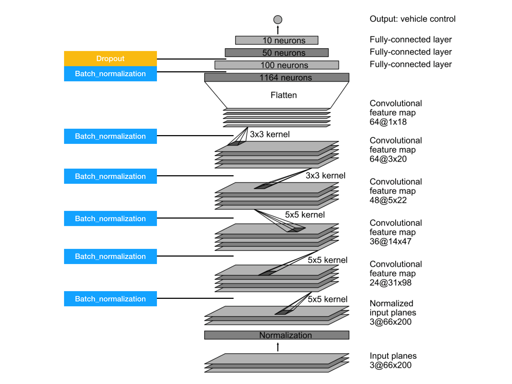

| Layer         		|     Description	        					| 
|:---------------------:|:---------------------------------------------:| 
| Input Image         	|  `160x320x3` RGB or `160x320x1` Gray image	                    | 
| Lambda Layer         	| Normalization and standardization layer   	                    | 
| Cropping2D Layer      | Crops the image and produces a `65x320x3`                         | 
| Lambda Layer(Optional)| Grayscales the image to get `65x320x1` image  				    | 
| Convolution `5x5`     	| `2x2` stride, VALID padding with relu activation, outputs `31x158x24` |
| Batch_normalization	| Batch normalization layer with default arguments			        |
| Convolution `5x5`     	| `2x2` stride, VALID padding, with relu activation, outputs `14x77x36` |
| Batch_normalization	| Batch normalization layer with default arguments 				    |
| Convolution `5x5`     	| `2x2` stride, SAME padding, with relu activation, outputs `5x37x48` 	|
| Batch_normalization	| Batch normalization layer with default arguments 			        |
| Convolution `3x3`     	| `1x1` stride, VALID padding, with relu activation, outputs `3x35x64` 	|
| Batch_normalization	| Batch normalization layer with default arguments 			        |
| Convolution `3x3`     	| `1x1` stride, VALID padding, with relu activation, outputs `1x33x64` 	|
| Batch_normalization	| Batch normalization layer with default arguments 			        |
| Flattening            | Flattened the `1x33x64`, output `2112` feature array                  |
| Batch_normalization	| Batch normalization layer with default arguments 			        |
| Fully connected		| Applies with relu activation, takes `2112`, and outputs `100`       	|
| Batch_normalization	| Batch normalization layer with default arguments 			        |
| Fully connected		| Applies with relu activation, takes `100`, and outputs `50`      		|
| Dropout               | Applies dropout of `0.3` to reduce overfitting                      |
| Fully connected		| Applies with relu activation, takes `50`, and outputs `10`      		|
| Regression layer   	| Takes	`10`, outputs `1` or `2` if multivariant							|
| Mean Squared Error	| Softmax cross entropy 						                    |
| AdamOptimizer         | Optimize the model with a decaying learning rate                  |

Even the unmodified Nvidia Model performed well on the track, but these modifications produced a more robust and well generalizing model. 

NOTES: I also found out that when the loss goes down to `0.03` and `0.02` it really doesn't make that big of a difference the real difference is seen on the track.

# Training Pipeline
______
* Normalization through Keras Lambda layer 
* Cropping layer 
* Either LeNet or Nvidia model
* Final Dense layer with depth of one node

### Normalization

So the first step in the pipeline was image normalization, I normalized the images by adding a *Keras* `Lambda` layer (I love these things) which serves as a normalizing layer for inference too.

### Grayscaling (Optional)

Here I had an *optional* `Lambda` layer that would grayscale the images by using a *Tensorflow* grayscaling method `K.tf.image.rgb_to_grayscale(x)`. In the long run I found out that colored images yield better results.

### Cropping

`Cropping2D` is another awesome layer from *Keras* that I used to crop the images to the meaningful parts of the road and cutting out things like the lake, trees, and others. I this layer would crop `70`pixels from the top which removes anything bu the road and `25` pixels form the bottom which takes care of the hood of the car. I managed to tryout different top cropping for track 2 to include more of the image because the track had ascending and descending slopes that occupy more of the image than the flat track 1, however, this change didn't produce any gains.

### Generator 

At the start of the project I used to load all the images, flip them, and then train the model via `fit()` I didn't even remember to batch, and all of that would fully use all of my PC's `16GB` of memory, this was all remedied after getting introduced to *Python generator*. Python generator is a method or a technique that behaves like an iterator and loads items when needed using the `yield` that is like a `return`, but keeps all the generator's variables intact.*Keras* `fit_generator()` uses generators to only load data batch by batch for a more optimized and data conscious approach, this reduced the memory consumbsion form more than `10GB` to `2GB` max even for high batch sizes like `512` and `1024`. There are also a *Keras* `Sequence` class that can be extended to have a modular implementation of data generators that I intend to apply in the future.

### Augmentation

For our meager data to perform well we can either collect countless laps and then collect other special laps for special scenarios like recovery and left or right biases, augmenting our existing data also gives a larger and better more a uniform  data than we had before. I'll be showing the augmentations that are done on the images on this example image from track 1 dataset.

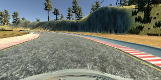

#### Flipped Images 

I applied the flip augmentation to the whole dataset to eliminate any angle bias that might affect the data, this is achieved by flipping the image and flipping its angle so that every image has an exact mirror view so negating any bias.

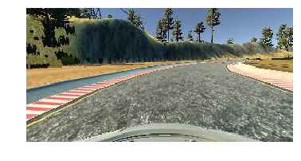

I use the *numpy* `flipr()` method to flip my *numpy* array images and multiply the steering angle with `-1.0`.

#### Random Shadow
Adding random shadow to the images was a good addition to the dataset, it helped the model generalize when I trained both tracks data together because the second track has a lot more shadows that the first one and adding some shadows to some of the first track's images made the model more robust for shadows. I chose to add random shadows to only `30%` of the data because most of the tracks were well lit so `30%` seemed like a good number. 

### Architecture

Here I can specify the architecture that I want to use to train the model, either `LeNet`, `Modified Nvidia`, or transfer learning like `VGG16` that I'll mention later in the report.

### Final layer 

Here I add either the default `1` layer for only predicting the steering angle or add `2` layers for the steering angle and throttle values if I'm using a multivariant approach that I'll talk about later.

# Training Approach 
____
Here I'll be talking about how I went about training my data, which approaches did I try, and the final model training process.

After choosing the Model architecture I still had to decide on how to train, 
* Do I have to record recovery laps?
* whats the best dropout value? 
* should I train each track by itself or combine them? 
* should I use augmentation? 
* how many epochs should I run? 
* do I change my image to gray? 
* should I include the throttle value in my prediction?

### Recovery Laps 

I found out that I didn't need to record any recovery laps after using all three *left*, *center*, and *right* camera images the addition of the *left* and *right* images and their corrections made the model recover from the worst deviations when I tried to mess up the car.

### Dropout
So after training the model for on a lot of architectures and observing the different dropout values I settled on `0.3` dropout because there is only one dropout layer at the end of the model, this value work really well it let the model train and at the same time prevented overfitting.

### Tracks

So I trained each track and got really good results with the Nvidia architecture, and after modifying the architecture the model was robust and consistent thats why I considered training both track on it which is why I also added the shadow augmentation to generalize between both tracks. 

Here are the combined images form both the Lake and the jungle tracks 

### Augmentation

I started training with just **flipping** the images which balanced out the data's distribution and provided more data, but after training the model on both tracks I decided to add the **random shadow** to better generalize the model.

### Epochs

I trained different architectures on `10` epochs to check if they have potential then on `20` I even trained a lot of them on `30` epochs which took about an hour each; However, after hours and hours of training I discovered *Keras early stopping*  callback which is amazing for the training time and even model quality, it stops training if the model *validation loss* or  other metric doesn't decrease for a certain amount of epochs which I set to  `3`. Unfortunately it was little too late for I used it on the last 2 training runs. I also used *Keras checkpointer* callback which saves the model at its lowest *validation loss*, it combined with early stopping made sure that I got the best run and did not train for many epochs. 

### Optimizer

I as usual opted for the powerful *Adamoptimizer* as it takes care of setting and changing the learning rate value.

### Grayscaling 

I trained the model on gray images and got somewhat worst results on the track, so I stuck with the colored RGB images .

### Multivariant 

I also trained the model to multivariant values steering angle as usual, and throttle. It gave a workable result, but it wasn't up to par with the single variable regression. Theres a saved model of the multivariant approach in the main directory if you want to check it out.

## Model Visualization

Here I'll visualized the trained model first and second convolutions activations for each track, this will give insights on how our model perceive the images.

### Track 1

First this is the image that we'll be testing the model activation on, I chose this image cause its an edge case were it has a rare dirt road occurrence on its right side of the road.

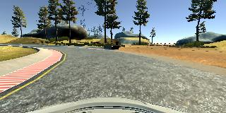

#### First Convolution

This is the first convolution activation with `24` images representing the output filters of the convolution and shape `31z158`.

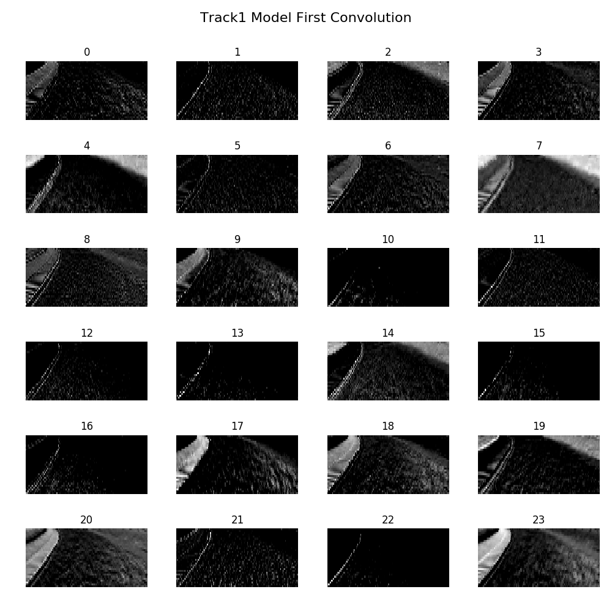

As we can see the images seem to focus on the road with most of the images emphasizing the left barrier, and others noting the presence of the right dirt road. This fist layer shows us the from early on our model has the basic shape of the road and its sides even if they're different in color and texture.

#### Second Convolution

The second convolution activation had `36` filter images of `14x77` pixels shape.

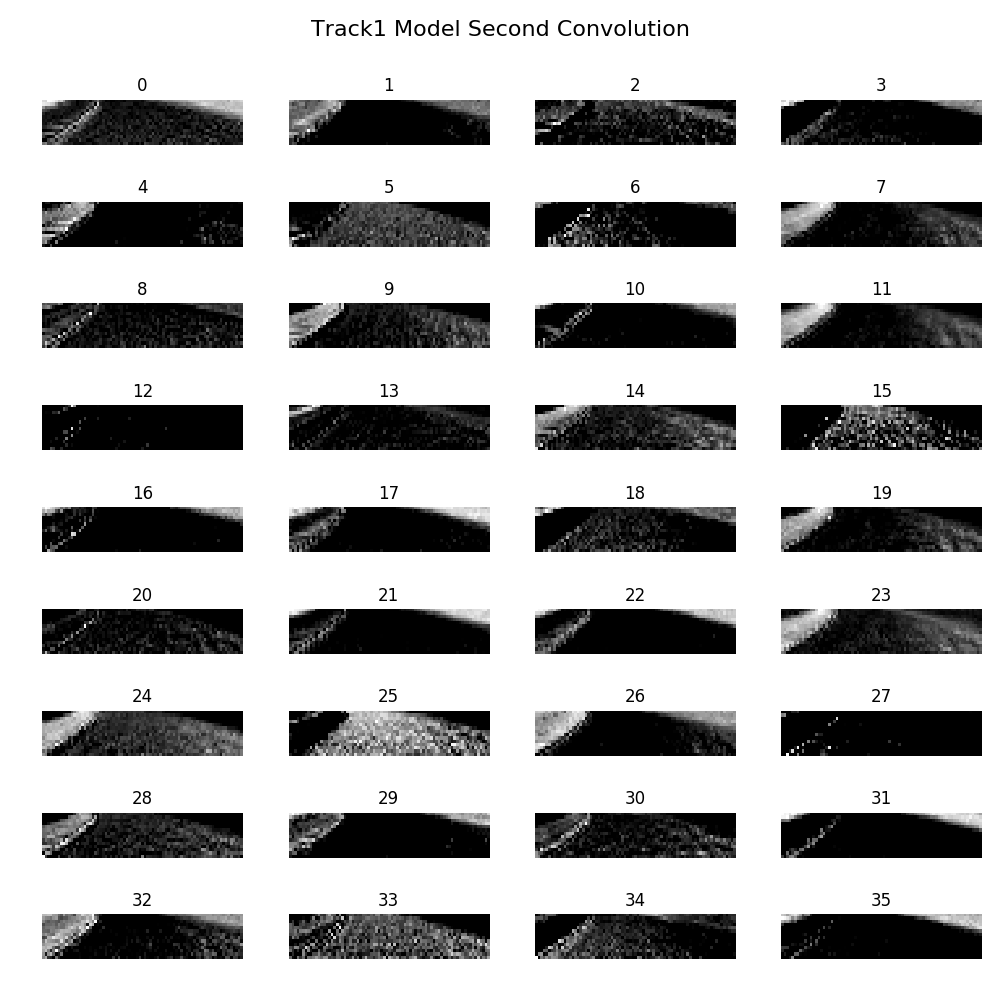

Here the images give a better representation of a curved road sure the image size decreased, but its still clear that the convolution gets the important information. As we can see in image `9`, `25`, `24`, `28`, and many others the drivable portion of the road has a different color and in some its highlighted.

### Track 2

I chose this track 2 image of a descending zigzag slope because I thought it would make for an interesting test of the model.   

#### First Convolution

This is how the first convolution look when activated by track 2 test image `24` images of its filters each `31x158` pixels:

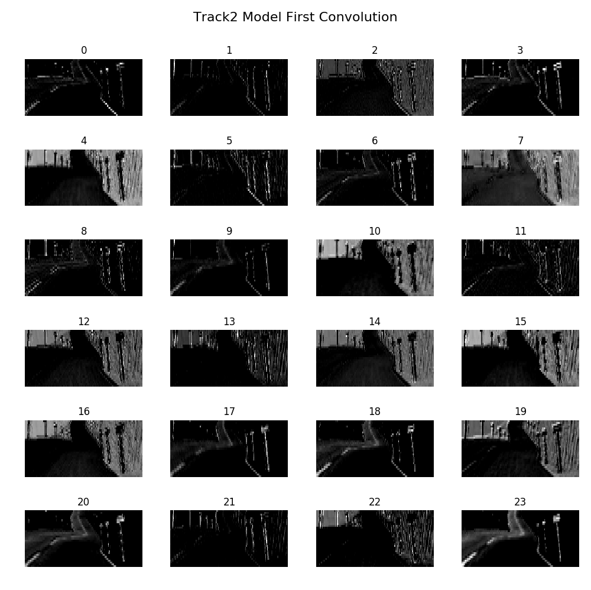

The images reflect that the first convolution captures information about the road ahead and it even gets some of the noise or undesired features like the hills of the right, however, all of the images clearly highlight the *drivable area* with some like `0` and `18` going as far as highlighting the *current lane*.

#### Second Convolution

This is how the second convolution look when activated by track 2 test image `36` images for each filter with each images of size `14x77` pixels:

Now most of the images ignore the hills and other distraction and focus on the drivable road, and many images highlight the current lane, for a complicated road like this the model managed to learn good information in the first 2 convolutions and it still has 3 more to go.

# Final Model Videos

I made 3 videos for each track with 3 different speeds `9mph`, `15mph`, and `20mph` to checkout the model robustness in different scenarios, all the links are included below. All the videos of the final model are located in the [`Videos`](./Videos/) directory.

## Track 1 Lake Track
* [9 mph video](./runs/final/track1_9mph.mp4)
* [15 mph video](./runs/final/track1_15mph.mp4)
* [20 mph video](./runs/final/track1_20mph.mp4)

## Track 2 Jungle Track
* [9 mph video](./runs/final/track2_(9mph.mp4)
* [15 mph video](./runs/final/track2_15mph.mp4)
* [20 mph video](./runs/final/track2_20mph.mp4)

# Additions and Exploration
----

## [`KerasModel`](./keras_model.py)

I created `KerasModel` a class that takes care of anything related to the model, it makes everything nice and modular and it helped a lot while training on multiple variations. This class creates or loads a model then sets up the model's preprocessing and architecture then it trains the model and saves it. It also visualize the model's layers as we'll see below. The class has some neat tricks for training that takes advantage of *Keras* awesome features.

Here are some of the awesome *Keras* features that I used in training:

So I set a couple of callbacks for my `fit_generator()` method:
* `tbCallback` Tensorboard callback to record the training metrics and *Tensorflow* graph.
* `EarlyStoppingCallBack` this stops the training if the validation loss value doesn't improve over `3` epochs.
* `checkpointer` which saves the model's best run every time the validation loss decreases across epochs. 

## [`drive.py`](./drive.py)
I had to make some interesting changes to the `drive.py` class in order to run the multivariant model, and to set the car speed as an argument from the console.

## Simulator 
I downloaded the simulator and looked around to find out the *left* and *right* camera positions relative to the the *center* camera, after a little bit of digging I found that the values are as follow `left={x:-8.06, y:1.2, z:1}`, `center={x:0, y: 1.2, z:1}`, and `right ={x:0.825, y:1.2, z:0.99}` thought I don't know these values scale. I wanted to know these values because I wanted to make a formula for the correction factor that I add or remove to get the *left* and *right* camera angles, I'll explore this more in the coming weeks.

multivariant 
## Transfer Learning 

I found the topic of transfer learning very fascinating so much so that I built my pipeline with the option of using any of the top image recognition models like *VGG*, *inceptionV3* , and *ResNet*.

# Conclusion
----

This project was really fun and I learned many things while working on it and wasted a lot of time training where I could've been using early stopping all along, well you live and learn. I found this project really rewarding and the feeling I got the first time the car navigated through the track was a feeling of pride, no matter how wonky or drunk the car seemed to be I was proud of ***it***. I used cool new tools like the simulator and got introduced to **Keras** which is a huge plus, also learning to create **python** generators and creating my own was a really good experience . I even developed a good training pipeline that I intend on reusing and improve in the future. The project made me explore different concepts and in constructing the model architecture many concepts and techniques became a lot clearer, most importantly having *dropout* and *batch normalization* work together in the same model. All n all this project taught me many concepts in the span of a week, this project raised the bar I hope the next projects will be as exciting and fun as this one.

# Potential Shortcomings and Possible Solutions
----
Here are so shortcoming that I need to address in the coming weeks as I advance through the course:

* Left and right camera steering angles factor calculation. 
* Multivariant model robustness and consistency, further exploration should go into creating a better multivariant model.
* The generator code needs revisiting I'm planing to do *Keras's* `Sequence` class implementation to have a more modular generator as demonstrated in [this](https://stanford.edu/~shervine/blog/keras-how-to-generate-data-on-the-fly.html) great tutorial.

I'm sure there are more, so please feel free to suggest improvements to either approach or code.  

# Acknolagement 

I would like to than everyone that lend me a had when I asked for it, my mentor Bill Kapsalis
who provided good guidance and constant support, Michael Virgo who never shies from a question and provides valuable help on the slack channels,other Udacity  that answer my questions and gave me good advice to improve, other community members who gave really good tips with either their answers or informative questions, and last but not least [StackOverflow.com](stackoverflow.com) for always being there for me. 

I would like to thank the authors of the papers that helped me build the model and links of their work are linked below:

* https://arxiv.org/pdf/1801.05134.pdf
* http://images.nvidia.com/content/tegra/automotive/images/2016/solutions/pdf/end-to-end-dl-using-px.pdf 
